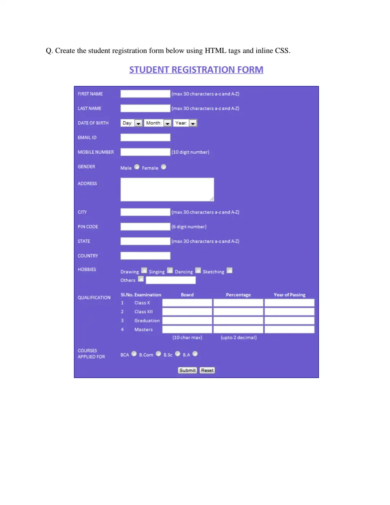

# Week 01-02 – Student Registration Form

This is a **simple student registration form** built using **HTML** and **inline CSS**.

## Assignment Task

## Features
- Input fields for student name, email, password, and contact number
- Inline styling for layout and colors
- Simple structure suitable for beginners

## How to Run
1. Open `index.html` in any web browser
2. Fill in the form to see how it appears

## Live Demo
You can view the live version here: [Student Registration Form](https://reg-form-ned-assignment.netlify.app/)

